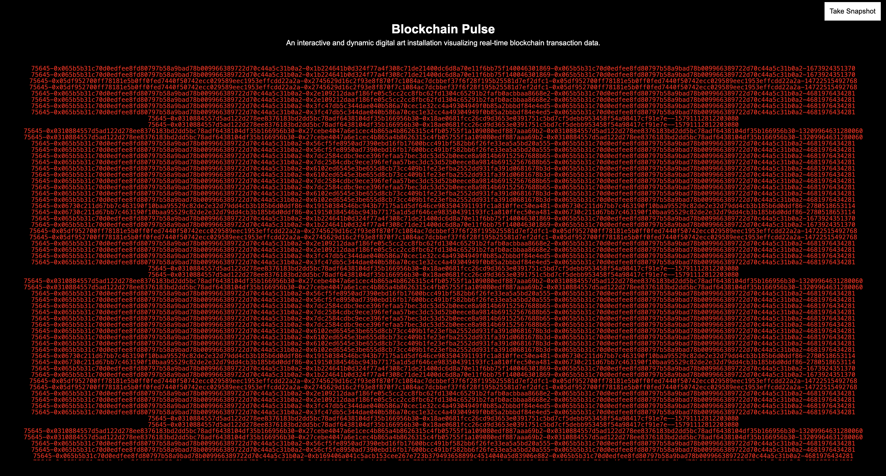

# Blockchain Pulse

ETH Global Link: [Blockchain Pulse Showcase](https://ethglobal.com/showcase/blockchain-pulse-rnnt1)

<div style="text-align: center;">
  
</div>

Blockchain Pulse is an interactive digital art installation that visualizes real-time blockchain transaction data on the Starknet network. Inspired by Tatsuo Miyajima's "Keep Changing, Connect with Everything, Continue Forever," this project transforms the dynamic activity of blockchain transactions into a continuously evolving piece of digital art.

## Table of Contents

- [Blockchain Pulse](#blockchain-pulse)
  - [Table of Contents](#table-of-contents)
  - [Introduction](#introduction)
  - [Features](#features)
  - [Technologies Used](#technologies-used)
  - [Images](#images)
  - [System Overview](#system-overview)
  - [Usage](#usage)
  - [Future Prospects](#future-prospects)
  - [Contributing](#contributing)
  - [License](#license)
  - [The Knocks Team](#the-knocks-team)

## Introduction

Blockchain Pulse visualizes live transaction data from Starknet, converting each transaction into unique visual elements. The project aims to showcase the constant flow of blockchain activity through dynamic and interactive art.

## Features

- **Real-time Data Visualization**: Displays live transaction data as visual patterns.

## Technologies Used

- **Voyager API**: Fetch transaction data from Staknet.
- **React**: Front-end library for building user interfaces.
- **Socket.IO**: Real-time communication library.

## Images

## System Overview

Blockchain Pulse consists of a front-end built with React and a back-end powered by Express. The system leverages the Voyager API to fetch transaction data from Starknet. The front-end and back-end communicate via WebSockets to ensure real-time updates of the transaction data on the screen.

```mermaid
graph TD
  A[User] --> B[Front-end (React)]
  B -->|WebSocket| C[Back-end (Express)]
  C -->|Fetches Data| D[Voyager API]
  D --> C
  C -->|Pushes Data| B
  B --> A


## Screenshots

<div style="text-align: center;">
  
</div>

## Installation

1. **Clone the repository**:
   ```bash
   git clone https://github.com/susumutomita/2024-StarkHack.git
   cd 2024-StarkHack
   ```

2. **Install dependencies**:
   ```bash
   make install_all
   ```

3. **Set up environment variables**:
   Create a `.env` file in the `backend/` directory and add your API keys and necessary configurations.

   ```plaintext
   VOYAGER_API_KEY=<Specify your Voyager API key>
   NODE_ENV=<development | production>
   ```

   Depending on the value of `NODE_ENV`, the connection destination will switch between `'https://api.voyager.online/beta'` and `'https://sepolia-api.voyager.online/beta'`.

4. **Run the server**:
   ```bash
   make start
   ```

## Usage

- Open your browser and navigate to `http://localhost:3000`.
- Interact with the visualization to explore real-time blockchain transactions.

## Future Prospects

- **NFT Generation**: Plan to implement NFT generation from snapshots of the visualizations.

## Contributing

We welcome contributions to Blockchain Pulse. Please fork the repository and submit pull requests for review. For major changes, please open an issue first to discuss what you would like to change.

## License

This project is licensed under the MIT License. See the [LICENSE](LICENSE) file for details.

## The Knocks Team

- [Susumu Tomita](https://www.linkedin.com/in/susumutomita/) - Full Stack Developer
