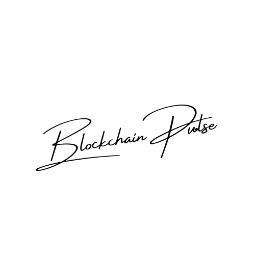

# Blockchain Pulse

ETH Global Link: https://ethglobal.com/showcase/blockchain-pulse-rnnt1

<div style="flex: 1; display: flex; flex-direction: column; align-items: center; justify-content: center">
  
</div>

Blockchain Pulse is an interactive digital art installation that visualizes real-time blockchain transaction data on the Starknet network. Inspired by Tatsuo Miyajima's "Keep Changing, Connect with Everything, Continue Forever" this project transforms the dynamic activity of blockchain transactions into a continuously evolving piece of digital art.

## Table of Contents

- [Blockchain Pulse](#blockchain-pulse)
  - [Table of Contents](#table-of-contents)
  - [Introduction](#introduction)
  - [Features](#features)
  - [Technologies Used](#technologies-used)
  - [Images](#images)
  - [System Overview](#system-overview)
  - [Screenshots](#screenshots)
  - [Installation](#installation)
  - [Usage](#usage)
  - [Future Prospects](#future-prospects)
  - [Contributing](#contributing)
  - [License](#license)
  - [The knocks team](#the-knocks-team)

## Introduction

Blockchain Pulse visualizes live transaction data from Starknet, converting each transaction into unique visual elements. The project aims to showcase the constant flow of blockchain activity through dynamic and interactive art.

## Features

- **Real-time Data Visualization**: Displays live transaction data as visual patterns.
- **Interactive Interface**: Allows users to interact with and influence the visualizations.
- **Dynamic Color and Shape Generation**: Generates unique visual representations for each transaction.
- **Privacy and Security**: Implements Zero-knowledge Proofs to maintain data privacy.

## Technologies Used

- **Starknet**: Layer 2 scaling solution for Ethereum.
- **Cairo**: Programming language for writing Starknet contracts.
- **Herodotus Storage Proof API**: API for accessing Ethereum data.
- **D3.js**: Library for creating data visualizations.
- **Three.js**: Library for 3D graphics.

## Images

## System Overview

TBD

## Screenshots

TBD

## Installation

1. **Clone the repository**:
   ```bash
   git clone https://github.com/susumutomita/2024-StarkHack.git
   cd 2024-StarkHack
   ```

2. **Install dependencies**:

   ```bash
   npm install
   ```

3. **Set up environment variables**:
   Create a `.env` file and add your API keys and necessary configurations.

4. **Run the development server**:

   ```bash
   npm start
   ```

## Usage

- Open your browser and navigate to `http://localhost:3000`.
- Interact with the visualization to explore real-time blockchain transactions.

## Future Prospects

TBD

## Contributing

We welcome contributions to Blockchain Pulse. Please fork the repository and submit pull requests for review. For major changes, please open an issue first to discuss what you would like to change.

## License

This project is licensed under the MIT License. See the [LICENSE](LICENSE) file for details.

## The knocks team

- [Susumu Tomita](https://www.linkedin.com/in/susumutomita/) - Full Stack Developer
